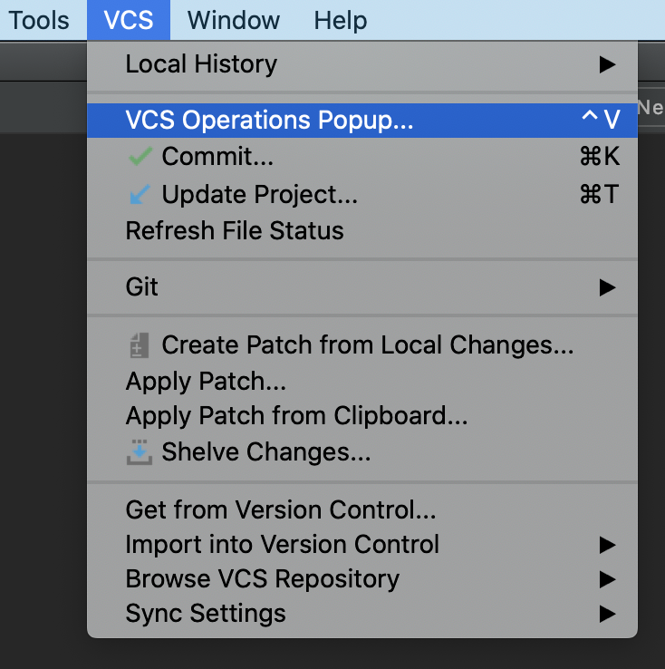
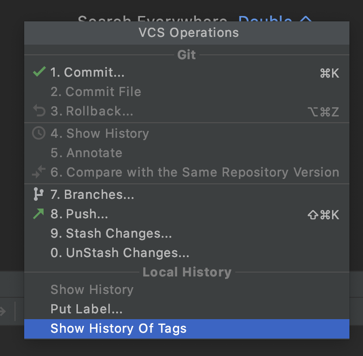

# Browse Tags Plugin
Do you manage your releases with git tags? 
Do you have Release Notes/What's New/ChangeLog file? 
Have you ever been in a pickle of trying to find in which exact release a feature was introduced and when?  
This is the plugin to the rescue  :tada:
  

Features:
- View all your tags in a list
- View the info about your tag (date/message if present)
- View a context of your Release Notes/What's New/ChangeLog file as it is in the tag
  

Usage instructions:
<ol>
<li>Have some git tags in your project</li>
<li>Open "VCS Operations Popup..."</li>

<li>Click on "Show History Of Tags"</li>

<li>Choose your Release Notes/What's new file (optional)</li>
<li>Choose a tag from the list on the left</li>
<li>See a Date, a message (if defined) and the context of a Release Notes/What's new file (optional) as it is for this tag</li>
</ol>
  
To install:
- Install from the Marketplace:
  - <kbd>Preferences</kbd> -> <kbd>Plugins</kbd> -> <kbd>Marketplace</kbd> -> <kbd>Make a search for "Browse Git Tags History"</kbd> -> <kbd>Enjoy</kbd>
- Or download [jar file](build/libs/browse-tags-plugin-1.0.jar) and install it manually:
  - <kbd>Preferences</kbd> -> <kbd>Plugins</kbd> -> <kbd>"Install Plugin from Disk..."</kbd> -> <kbd>Open the downloaded file</kbd> -> <kbd>Enjoy</kbd>

  
  

