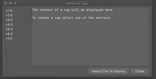

# Browse Tags Plugin
Do you manage your releases with git tags? 
Do you have Release Notes/What's New/ChangeLog file? 
Have you ever been in a pickle of trying to find in which exact release a feature was introduced and when?  
This is the plugin to the rescue  :tada:
  

Features:
- View all your tags in a list
- View the info about your tag (date/message if present)
- View a context of any file in your project as it looks like based on tag
  

